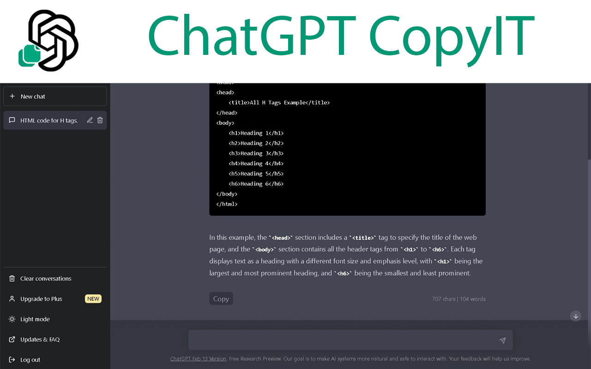
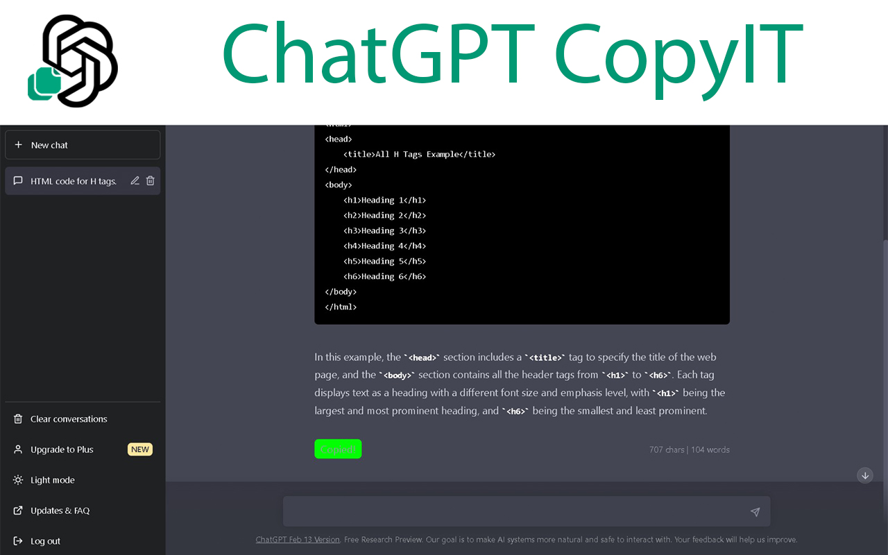
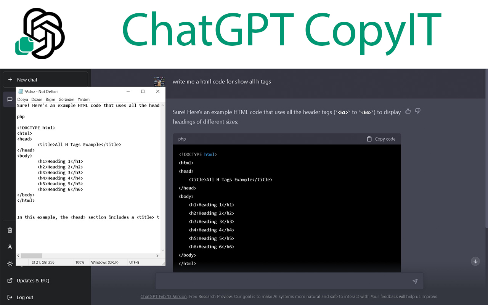

[# ChatGPT CopyIt Chrome Extension](https://chrome.google.com/webstore/detail/chatgpt-copyit/ogakgacjkoojmdahpelppalilhhplnbe?hl=en&authuser=0)

This Chrome extension adds a "Copy" button to the end of each answer in OpenAI's chat interface. It also shows the number of characters and words in each answer.

  <h1>ChatGPT CopyIt Chrome Extension</h1>
  
  

  Author:
    <a href="https://linktr.ee/muffafa" target="_blank">Muhammed Mustafa (muffafa) Savar</a> 
    <small> February, 2023</small>
  

## Installation

YOU CAN DIRECTLY [DOWNLOAD](https://chrome.google.com/webstore/detail/chatgpt-copyit/ogakgacjkoojmdahpelppalilhhplnbe) IT FROM CHROME WEBSTORE 

1. Download the `ChatGPT-CopyIt-Chrome-Extension` folder to your local machine.
2. Open Google Chrome and navigate to the "Extensions" page.
3. Turn on "Developer mode".
4. Click "Load unpacked" and select the `ChatGPT-CopyIt-Chrome-Extension` folder.

## How to Use

1. Open the chat interface in OpenAI.
2. Scroll to the bottom of an answer to see the "Copy" button.

3. Click the "Copy" button to copy the text to your clipboard.

4. You can paste it anywhere you want!

